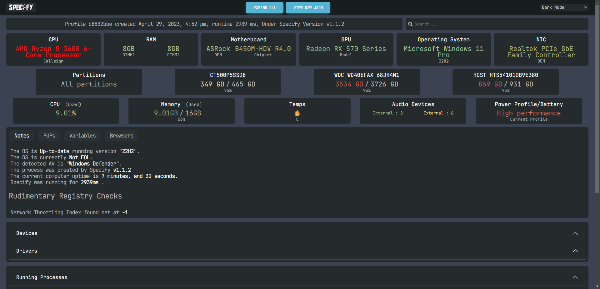

# HOW TO MAKE A SNAPSHOT WITH SPECIFY

***
**Source: https://github.com/Spec-ify/specify**  
**Website: https://spec-ify.com/**

> [!NOTE]  
> Specify gathers info on your system that you may not want shared like your username (which can be hidden), installed programs, and running programs.

> [!NOTE]  
> Snapshot will be deleted after 24 hours

***

# INSTALLATION

1. Download Specify from this link: https://github.com/Spec-ify/specify/releases/latest/download/Specify.exe

  
  
2. Open it and you should see a menu

> [!NOTE]  
> Click **"Remove Username"** if you want to hide your Windows username

  
Click **Start**  
  
3. After waiting a few seconds, it should open a website with your snapshot and also copy the link to your clipboard  

