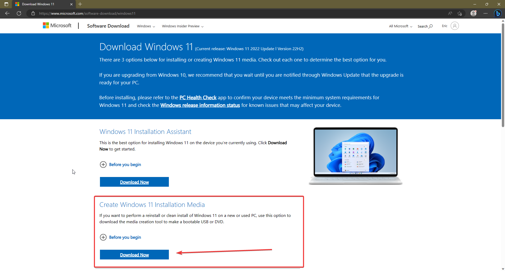
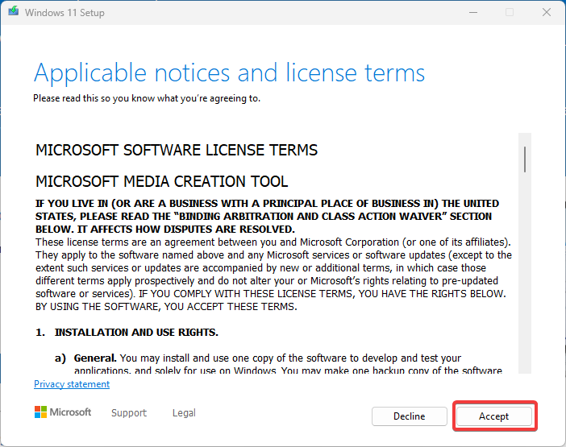
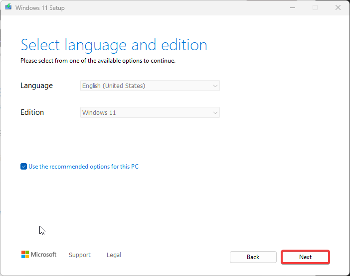
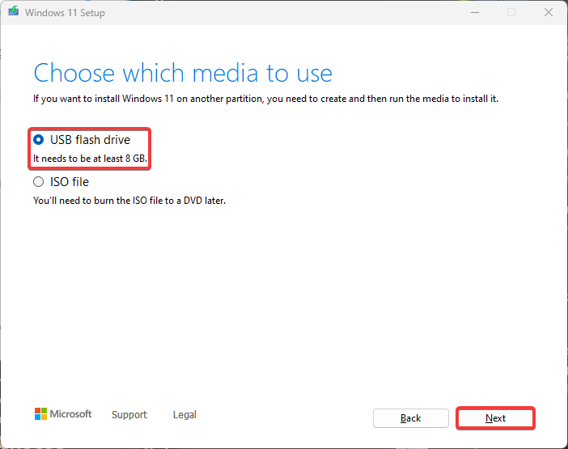

# WINDOWS 11

## 1. GO TO THE [Windows 11 download page](https://www.microsoft.com/software-download/windows11)

## 2. DOWNLOAD THE INSTALLATION MEDIA TOOL

## 3. OPEN IT AND ACCEPT THE TERMS OF SERVICE

## 4. PRESS NEXT

> [!NOTE]  
> If you don't want English, uncheck `"Use the recommended options for this PC"` and choose your language

## 5. CHOOSE USB FLASH DRIVE AND PRESS NEXT

##